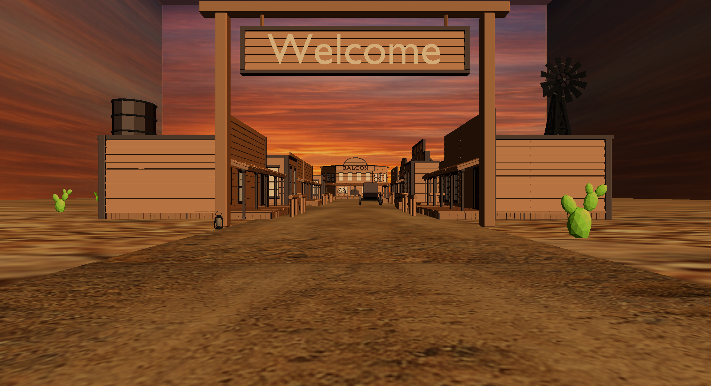

# Simulação de Cidade do Velho Oeste | Projeto Final

## Sumário

 - [Descrição](#descrição)
 - [Instalação e Execução](#instalação-e-execução)
    - Instruções de requisitos, como instalar, compilar e executar;
 - [Dificuldades Encontradas](#dificuldades-encontradas)
 - [Melhorias Futuras](#melhorias-futuras)
 - [Elementos das Atividades Práticas](#elementos-das-atividades-práticas)
 - [Trabalhos dos Integrantes](#trabalhos-dos-integrantes)
 - [Referências](#referências)

## Descrição

O projeto simula o ambiente de uma pequena cidade do Velho Oeste. Para isso, foi utilizado OpenGl 2.1, linguagem de programação C, com as bibliotecas `tinyobj_loader_c.h` para carregar arquivos .obj no OpenGl, `stb_image.h` para carregar texturas nas superfícies, e modelos low poly para o cenário de Velho Oeste, a partir dos quais foi possível construir os prédios da cidade. Para montar os prédios, foi utilizado Blender, que também foi aplicado para a conversão dos arquivos de modelos .fbx para .obj (vide o script em `src/script_fbx_to_obj_blender.py`).

Com isso, foi necessário criar o mundo, que apresenta uma rua principal e uma estrada perpendicular à principal; as ruas possuem casas, prédios, carruagem e demais elementos para criação da ambientação associada ao Velho Oeste.

## Instalação e Execução

1. Após baixar o arquivo compactado ``icg_project-main.zip``, extraia seu conteúdo.

2. Depois de descompactar, você terá um diretório nomeado ``icg_project-main``.

3. Acesse as pastas relevantes por meio de seu terminal ``$ cd icg_project-main\src``.

4. Certifique-se que as dependências (diretórios ``predios``, ``texturas`` e arquivos ``stb_image.h``, ``tinyobj_loader_c.h`` e ``script_fbx_to_obj_blender.py``) estejam em src.

5. Após isso, execute em seu terminal o comando ``$ g++ projeto_icg.c -o projeto_icg -lGL -lGLU -lglut && ./projeto_icg``.

6. Após executar, a janela com o ambiente deve aparecer. É possível se mover no mundo usando as teclas: W, A, S, D e controlar a câmera com Q, E.

## Dificuldades Encontradas

Uma das maiores dificuldades está relacionada a carregar os modelos .obj em que, mais especificamente, foi necessário entender a estrutura de dados usada pela biblioteca `tinyobjloader-c` para armazenar as informações relativas aos modelos importados. Assim, foi necessário estudar para acessar os arrays de dados corretamente.

## Melhorias Futuras

Como melhorias futuras, podemos listar:
- Adição de física aos objetos, permitindo que o usuário interaja com o mundo. 
- Inclusão de dinâmica de dia e noite, bem como outras fontes de luz no ambiente para adicionar complexidade e profundidade ao mundo.
- Aumento dos limites do mundo, adição de mais prédios e objetos para enriquecer a ambientação e imersão no mundo.

## Elementos das Atividades Práticas

Atividade 2: Uso e manipulação do gluLookAt, gluPerspective e glFrustum e uso de glPushMatrix e glPopMatrix na criação de objetos e modelos no mundo.

Atividade 3: Utilização do Z-Buffer para lidar com o problema de oclusão.

Atividade 4: Adição de fonte de luz, no caso implementado, representando o sol da cena.

Atividade 5: Adição de texturas para o chão, caminho principal, bola de feno e céu.

Atividade 6: Uso de spline de bèzier para implementar o movimento utilizado na bola de feno.

## Trabalhos dos Integrantes

[@ArthurH35](https://github.com/ArthurH35):
- Construção do layout da cidade.
- Adição de elementos e modelos para ambientação.
- Implementação do movimento da câmera.
- Implementação das splines usadas para adicionar movimento a um dos objetos.

[@LudmilaGomes](https://github.com/LudmilaGomes):
- Adaptação dos modelos 3D das estruturas a partir de fonte open source.
- Configuração para importar os modelos no código do projeto.
- Adição de texturas e iluminação.
- Construção do interior de uma das estruturas.

## Referências

Bibliotecas e recursos externos utilizados, como já foram mencionados anteriormente:

- [tinyobjloader-c](https://github.com/syoyo/tinyobjloader-c/blob/master/tinyobj_loader_c.h), para carregar os modelos .obj.
- [stb](https://github.com/nothings/stb/blob/master/stb_image.h), para carregar texturas nos modelos.
- [Low Poly Wild West](https://lowpolyassets.itch.io/low-poly-wild-west), que oferece modelos low poly disponíveis gratuitamente para uso.